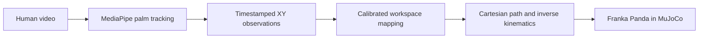

# MORPH

### Human demonstrations toward robot manipulation

MORPH is a research prototype for turning a human tabletop demonstration into a Cartesian trajectory for a simulated Franka Panda. It combines video-based hand tracking, explicit image-to-workspace mapping, inverse kinematics, and a MuJoCo manipulation baseline.

<p align="center">
  
  <br>
  <em>Measured end-effector path and tracking error from the simulated pick-and-place baseline.</em>
</p>

> **Current status:** the simulation baseline and human-video processing tools are implemented. The first real human recording has not yet been collected, so human-to-robot results are not reported.

## The idea

A person performs a simple tabletop task. The system tracks the palm in the video, maps its image coordinates to a bounded Panda workspace, and replays the resulting path through inverse kinematics.



The simulation also has a separate scripted **oracle** pick-and-place sequence. It checks that the table, cube, gripper, contact physics, and target region form a solvable task before human demonstrations are introduced. The current video replay follows a mapped hand path; it does not yet infer object intent or execute a human-guided grasp policy.

## Measured simulation baseline

The oracle sequence was run in MuJoCo and checked against physical cube contact, lift, target location, and low final velocity.

| Measurement | Result |
| --- | ---: |
| Pick-and-place outcome | Success |
| Cube lifted and placed | Yes |
| Maximum cube height | 0.590 m |
| Final cube center | (0.557, −0.168, 0.425) m |
| Target center | (0.550, −0.150, 0.425) m |
| Final XY distance from target center | 0.0195 m |
| Simulation samples | 7,592 |
| Unconverged IK samples | 0 |

These are results from the scripted simulation baseline, not from a human demonstration. The source measurements are in [`results/metrics/pick_place.json`](results/metrics/pick_place.json) and [`results/metrics/pick_place.csv`](results/metrics/pick_place.csv).

## What is implemented

- Panda end-effector state, damped inverse kinematics, and Cartesian path following.
- A MuJoCo table, cube, target region, and gripper with a measured oracle pick-and-place.
- Local import of original MP4, MOV, M4V, or AVI recordings with a metadata sidecar.
- MediaPipe hand tracking with decoded video timestamps, confidence scores, and an annotated video for inspection.
- Explicit image bounds, fixed robot height, missing-frame interpolation, smoothing, and a Cartesian speed cap.
- A replay command that records target-versus-actual simulation measurements as CSV, JSON, and PNG.

## Quick start

### Requirements

- macOS on Apple Silicon, Python 3.14, and the packages in [`requirements.txt`](requirements.txt).
- The Franka Panda scene from [MuJoCo Menagerie](https://github.com/google-deepmind/mujoco_menagerie). The current default path is `~/Documents/mujoco_menagerie/franka_emika_panda/scene.xml`; update `DEFAULT_MODEL_PATH` in `src/simulation/panda_env.py` if your checkout is elsewhere.
- `mjpython` for commands that open the MuJoCo viewer on macOS.

```bash
git clone https://github.com/yahiag04/MORPH.git
cd MORPH
git clone https://github.com/google-deepmind/mujoco_menagerie.git ~/Documents/mujoco_menagerie
python3 -m venv ~/Documents/.venv
source ~/Documents/.venv/bin/activate
python -m pip install -r requirements.txt
```

### Run the simulation baseline

```bash
PYTHONPATH=src mjpython scripts/run_pick_place.py
```

The script opens the viewer and saves measured outputs under `results/metrics/` and `results/figures/`.

### Process a human demonstration

Import one original phone video, then track and map the hand path:

```bash
source ~/Documents/.venv/bin/activate
PYTHONPATH=src python scripts/import_demonstration.py /path/to/overhead_video.mp4
PYTHONPATH=src python scripts/process_video.py data/raw/demo_001.mp4
PYTHONPATH=src python scripts/retarget_trajectory.py \
  data/processed/demo_001.csv \
  --output data/trajectories/demo_001.csv \
  --image-bounds 0.20 0.80 0.15 0.85 \
  --robot-bounds 0.38 0.68 -0.22 0.22 \
  --robot-z 0.62
PYTHONPATH=src mjpython scripts/replay_demo.py \
  data/trajectories/demo_001.csv \
  --results-name demo_001
```

The first processing run downloads the pinned MediaPipe hand-landmarker model to `assets/models/` and verifies its SHA-256 checksum. Videos, extracted trajectories, and the downloaded model are ignored by Git and stay local. MediaPipe processes video frames on-device and reports API usage and performance metrics to Google.

Read the full [recording, calibration, and processing protocol](docs/data_collection.md) before interpreting a replay. The default workspace bounds are starting assumptions; calibrate them to the actual camera view. Monocular video does not provide metric hand height, so the current mapping uses a fixed Z plane.

## Repository map

```text
src/
  perception/       video import, hand tracking, workspace mapping
  simulation/       Panda environment, IK, trajectory and pick-place control
  evaluation/       measured trajectory plots
scripts/            runnable import, processing, retargeting, and simulation commands
data/
  raw/              local source videos (ignored)
  processed/        local tracking output (ignored)
  trajectories/     local robot paths (ignored)
results/
  metrics/          checked-in simulation measurements
  figures/          checked-in simulation plots
tests/              unit tests and generated-video fixtures
```

## Limitations and next steps

- There is no real human demonstration in the repository yet; the hand-tracking pipeline still needs to be validated on the first recording.
- The current tracker follows a palm point, not the object, and does not classify task phases or grasp intent.
- Camera-to-robot bounds must be calibrated for the recording setup. The current mapping uses a fixed Z and cannot recover physical depth from a single video.
- The oracle baseline is scripted and uses a simple cube. Its success does not establish performance on human demonstrations.
- Temporal nearest-palm tracking can still confuse hands that cross or move close together.

Next, process real overhead recordings, inspect the annotated tracking video, calibrate the workspace, and compare direct retargeting against a confidence-aware variant. Add results only after those experiments have been run.

## Verification

Run the test suite from the repository root:

```bash
PYTHONPATH=src python -m unittest discover -s tests -v
```

At the current milestone, all 55 tests pass. Video tests use generated temporary fixtures; they do not count as human demonstration data.
