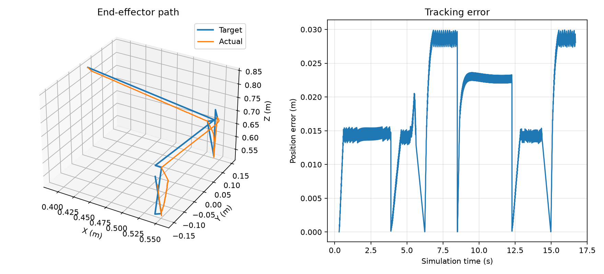
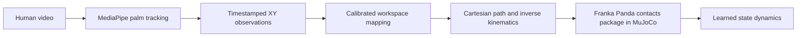
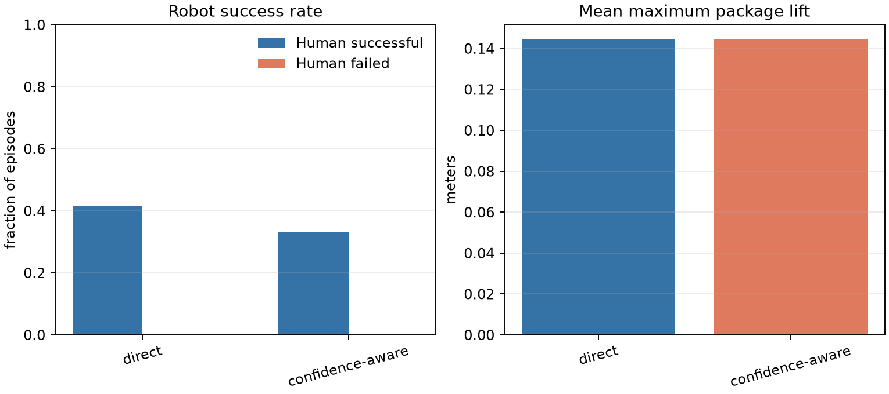

# MORPH

### Human demonstrations toward robot manipulation

MORPH is a research prototype for turning a human tabletop demonstration into a Cartesian trajectory for a simulated Franka Panda. It combines video-based hand tracking, explicit image-to-workspace mapping, inverse kinematics, and a MuJoCo manipulation baseline.

<p align="center">
  
  <br>
  <em>Measured end-effector path and tracking error from the simulated pick-and-place baseline.</em>
</p>

> **Current status:** 16 overhead recordings (12 human-labeled successful, 4 failed) drive contact-manipulation simulations and a learned state-dynamics model. The reported robot outcomes and world-model transitions come from MuJoCo; they are not physical-robot validation.

## The idea

A person moves a small package from a pickup point toward a bowl. The system tracks the hand, estimates pickup and target locations, maps the demonstration into a Panda workspace, and uses the resulting commands to operate a physical contact simulation. An action-conditioned model then predicts how the simulated task state changes.



The simulation includes a free-moving package and a colliding tray. The gripper can lift and release the package through contact; the package is not attached or teleported. A separate scripted oracle remains as a physics sanity check.

## Measured simulation baseline

The oracle sequence was run in MuJoCo and checked against physical cube contact, lift, target location, and low final velocity.

| Measurement | Result |
| --- | ---: |
| Pick-and-place outcome | Success |
| Cube lifted and placed | Yes |
| Maximum cube height | 0.590 m |
| Final cube center | (0.557, −0.168, 0.425) m |
| Target center | (0.550, −0.150, 0.425) m |
| Final XY distance from target center | 0.0195 m |
| Simulation samples | 7,592 |
| Unconverged IK samples | 0 |

These are results from the scripted simulation baseline, not from a human demonstration. The source measurements are in [`results/metrics/pick_place.json`](results/metrics/pick_place.json) and [`results/metrics/pick_place.csv`](results/metrics/pick_place.csv).

## Contact task replay from human demonstrations

Sixteen phone videos were processed locally: 12 were labeled `riusciti` and 4 `falliti`. Each clip was replayed with direct and confidence-aware retargeting. The controller uses detected package and tray locations, then relies on Panda gripper contact and MuJoCo physics to pick up, carry, and release the package.

| Simulation outcome | Direct | Confidence-aware |
| --- | ---: | ---: |
| All episodes successful | 5/16 (31.3%) | 4/16 (25.0%) |
| Human-labeled successful episodes completed | 5/12 (41.7%) | 4/12 (33.3%) |
| Human-labeled failed episodes completed | 0/4 | 0/4 |

<p align="center">
  
</p>

The simulation success criteria require physical package lift and stable placement in the tray. Human labels describe only the recorded attempt and are not treated as robot outcomes. This is a prototype proxy: workspace bounds are assumed, and no real robot was evaluated. Aggregate metrics are in [`results/metrics/contact_manipulation.json`](results/metrics/contact_manipulation.json); per-clip data and recordings stay local.

## Action-conditioned world model

The V2 predictor uses a 37-value robot, package, contact, and tray state; a five-member ensemble predicts continuous state changes and classifies the two contact flags separately. Training uses contiguous sequences with losses at 1, 5, and 25 control steps. Residual gains are calibrated on inner validation clips to reduce autoregressive drift. Evaluation uses four outer folds grouped by source video, so direct and confidence-aware replays of one video always remain together.

| Held-out group (25-step RMSE) | World model | Persistence |
| --- | ---: | ---: |
| End-effector position (m) | 0.0193 | 0.0764 |
| Arm position (rad) | 0.0284 | 0.1054 |
| Package position (m) | 0.0341 | 0.0522 |
| Arm velocity (rad/s) | 0.0226 | 0.0463 |
| Package orientation (quaternion components) | 0.1567 | 0.1840 |
| Package linear velocity (m/s) | 0.0217 | 0.0197 |
| Package angular velocity (rad/s) | 0.3501 | 0.3501 |
| Gripper aperture (m) | 0.0156 | 0.0382 |
| Gripper velocity (m/s) | 0.0408 | 0.0472 |

Contact classification at the rollout endpoint reaches 89.1% accuracy and 89.5% F1 across 234 rollouts. The model improves most evaluated groups over persistence; package linear velocity remains slightly worse, and angular velocity falls back to persistence after validation calibration. These results come from simulated transitions driven by 16 videos and do not establish real-robot performance. The four-fold results and fold spread are in [`results/metrics/world_model_v2.json`](results/metrics/world_model_v2.json), with a grouped comparison in [`results/figures/world_model_v2.png`](results/figures/world_model_v2.png).

V1 used a 19-value state and reported a pooled normalized RMSE of 0.3272 versus 0.1744 for persistence at 0.5 seconds. V2 changes the state schema and reports physical state groups separately, so the V1 aggregate is retained only as a historical baseline and is not numerically compared with V2. See [`results/metrics/world_model.json`](results/metrics/world_model.json) for the original V1 report.

## What is implemented

- Panda end-effector state, damped inverse kinematics, and Cartesian path following.
- A MuJoCo table, cube, target region, and gripper with a measured oracle pick-and-place.
- Local import of original MP4, MOV, M4V, or AVI recordings with a metadata sidecar.
- MediaPipe hand tracking with decoded video timestamps, confidence scores, and an annotated video for inspection.
- Explicit image bounds, fixed robot height, missing-frame interpolation, smoothing, and a Cartesian speed cap.
- A replay command that records target-versus-actual simulation measurements as CSV, JSON, and PNG.
- Per-video workspace marker calibration, batch processing, paired local human/Panda video rendering, and aggregate method evaluation.
- Contact-based package transfer in MuJoCo and four-fold source-video-held-out state prediction.

## Quick start

### Requirements

- macOS on Apple Silicon, Python 3.14, and the packages in [`requirements.txt`](requirements.txt).
- The Franka Panda scene from [MuJoCo Menagerie](https://github.com/google-deepmind/mujoco_menagerie). The current default path is `~/Documents/mujoco_menagerie/franka_emika_panda/scene.xml`; update `DEFAULT_MODEL_PATH` in `src/simulation/panda_env.py` if your checkout is elsewhere.
- `mjpython` for commands that open the MuJoCo viewer on macOS.

```bash
git clone https://github.com/yahiag04/MORPH.git
cd MORPH
git clone https://github.com/google-deepmind/mujoco_menagerie.git ~/Documents/mujoco_menagerie
python3 -m venv ~/Documents/.venv
source ~/Documents/.venv/bin/activate
python -m pip install -r requirements.txt
```

### Run the simulation baseline

```bash
PYTHONPATH=src mjpython scripts/run_pick_place.py
```

The script opens the viewer and saves measured outputs under `results/metrics/` and `results/figures/`.

### Process and evaluate human demonstrations

Put original clips in immediate label subfolders such as `riusciti/` and `falliti/`. The scripts write frame-level data, review videos, and calibration files to directories outside the repository. Keep your source videos private and inspect the marker review images before interpreting results.

```bash
source ~/Documents/.venv/bin/activate
PYTHONPATH=src python scripts/process_dataset.py /path/to/videos \
  --output-dir /path/to/local_morph_data
PYTHONPATH=src python scripts/calibrate_workspace.py /path/to/videos \
  --output-dir /path/to/local_morph_data/calibrations
PYTHONPATH=src python scripts/evaluate_demonstrations.py \
  --processing-manifest /path/to/local_morph_data/processing_manifest.json \
  --calibration-dir /path/to/local_morph_data/calibrations \
  --output-dir /path/to/local_morph_evaluation
PYTHONPATH=src python scripts/evaluate_contact_demos.py \
  --processing-manifest /path/to/local_morph_data/processing_manifest.json \
  --calibration-dir /path/to/local_morph_data/calibrations \
  --output-dir /path/to/local_contact_evaluation
```

The first processing run downloads the pinned MediaPipe hand-landmarker model to `assets/models/` and verifies its SHA-256 checksum. MediaPipe processes video frames on-device and reports API usage and performance metrics to Google. To make a paired demo for one clip after evaluation, use its annotated recording and trajectory CSV:

```bash
PYTHONPATH=src python scripts/make_paired_demo.py \
  /path/to/local_morph_data/processed/riusciti/example_tracked.mp4 \
  /path/to/local_morph_evaluation/per_clip/riusciti/example/direct_trajectory.csv \
  --output-dir /path/to/local_paired_demo
```

The script creates a Panda replay and a side-by-side MP4. These videos and per-clip files remain local; only aggregate metrics and a plot are checked in.

### Train the optional world model

Keep the existing MuJoCo environment unchanged and create a separate Python environment with PyTorch (`python3 -m venv ~/Documents/.venv-world-model`, activate it, then `python -m pip install -r requirements.txt requirements-world-model.txt`). Generate contact transitions with `scripts/evaluate_contact_demos.py` as shown above, writing results outside the repository, then train and evaluate:

```bash
PYTHONPATH=src python scripts/train_world_model.py \
  --direct-transitions /path/to/contact_evaluation/direct_transitions.npz \
  --confidence-transitions /path/to/contact_evaluation/confidence-aware_transitions.npz \
  --output-dir /path/to/local_world_model
```

The command saves the checkpoint and clip-level details locally. The checked-in metrics and figure contain aggregate values only. `--help` lists available training options.

Read the full [recording, calibration, and processing protocol](docs/data_collection.md) before interpreting a replay. Marker calibration maps the recorded workspace corners to assumed robot XY bounds; it does not measure camera-to-robot geometry. Monocular video does not provide metric hand height, so the current mapping uses a fixed Z plane.

## Repository map

```text
src/
  perception/       video import, hand tracking, workspace mapping
  simulation/       Panda environment, IK, trajectory and pick-place control
  evaluation/       contact outcomes and trajectory evaluation
  world_model/      action-conditioned state prediction
scripts/            runnable import, processing, retargeting, simulation, and training commands
data/
  raw/              local source videos (ignored)
  processed/        local tracking output (ignored)
  trajectories/     local robot paths (ignored)
results/
  metrics/          checked-in simulation measurements
  figures/          checked-in simulation plots
tests/              unit tests and generated-video fixtures
```

## Limitations and next steps

- The Panda success rates and learned transitions come from simulation. No physical robot grasp or transfer has been evaluated.
- The current tracker follows a palm point, not the object, and does not classify task phases or grasp intent.
- Camera-to-robot bounds must be calibrated for the recording setup. The current mapping uses a fixed Z and cannot recover physical depth from a single video.
- The oracle baseline is scripted and uses a simple cube. Its success does not establish performance on human demonstrations.
- Temporal nearest-palm tracking can still confuse hands that cross or move close together.

The current world model does not beat persistence over a 0.5-second rollout. Improve long-horizon dynamics prediction and validate camera-to-robot geometry before transferring this pipeline to a physical robot.

## Verification

Run the test suite from the repository root:

```bash
PYTHONPATH=src python -m unittest discover -s tests -v
```

At the current milestone, run the suite with the command above. Video unit tests use generated temporary fixtures; the 16 recordings used for the published aggregate remain local and are not included in the repository.
