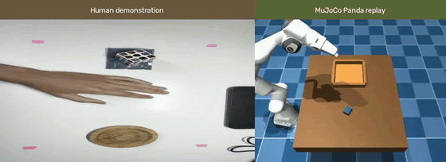

# MORPH: A Demonstration-Grounded Manipulation World Model

**MORPH turns overhead human demonstrations into action-conditioned Panda manipulation rollouts in MuJoCo.** The project studies whether a compact learned simulator can predict robot, object, and contact state from commands retargeted from a person's hand motion.

<p align="center">
  <a href="results/videos/human_to_panda.mp4">
    
  </a>
  <br>
  <em>One human demonstration and its direct-retargeted MuJoCo Panda replay. Select the preview to open the full MP4.</em>
</p>

## Abstract

Sixteen overhead phone recordings provide hand-motion demonstrations for a tabletop pick-and-place task. Each recording drives two retargeting variants in a contact-rich MuJoCo scene. From the resulting transitions, a five-member ensemble learns an action-conditioned mapping from a 37-dimensional robot-and-object state and a four-dimensional command to the next state.

Evaluation holds out whole source videos: both retargeting variants from one recording always stay in the same outer fold. Across four folds, the model improves end-effector and arm-position prediction over a persistence baseline from 0.5 seconds through the longest shared episode prefix of 11.2 seconds. Package velocity prediction remains weaker than persistence, and at 0.5 and 2.5 seconds package-position persistence is better. The full-episode score does not rank simulated outcomes on this batch: cross-video pairwise accuracy is 50%, and selecting the highest-scored candidate has regret 1.0. All robot outcomes are simulated; no physical robot was evaluated.

A separate V3 development ablation trains actuator-conditioned dynamics on randomized MuJoCo families. On 29 validation families, event oversampling improves package-position prediction around contact transitions, while uniform sampling gives lower error on uniformly selected windows. This comparison uses one training seed and does not establish a universally superior model; V3 action ranking and online control have not been evaluated.

## Contributions

- A video-grounded pipeline from palm tracking and workspace mapping to Panda contact simulation.
- A learned, action-conditioned state-transition model trained on transitions driven by 16 personal demonstrations.
- Source-video-held-out, multi-horizon evaluation with persistence baselines, contact metrics, ensemble disagreement, and episode-level task scoring.
- A paired human-video and MuJoCo replay for qualitative inspection.

## Task and demonstration data

The task moves a small package from a tabletop pickup area into a tray. The Panda follows a Cartesian hand path retargeted from each video. Package lift, support, and motion come from MuJoCo contact physics; the package is neither attached nor teleported.

| Data | Count | Use |
| --- | ---: | --- |
| Human recordings | 16 (12 labeled successful, 4 labeled failed) | Source demonstrations; labels describe only the human attempt |
| Retargeted simulation episodes | 32 | Two command-generation methods per recording |
| State transitions | 25,920 | Learned-model data, sampled every 20 ms |
| Outer evaluation | 4 folds grouped by source video | Both methods from a video are held out together |

The state contains end-effector and arm motion, package pose and velocity, gripper state, contact flags, and tray position. The four action values encode the Cartesian command and gripper command. The ensemble predicts continuous state changes and classifies gripper and support contacts separately.

Each ensemble member is a three-layer, 128-unit SiLU network. Members are bootstrapped by source video. The training objective combines one-step transition prediction with autoregressive losses at 1, 5, and 25 steps. State and action normalization, early stopping, and residual-gain calibration use only the training and inner-validation videos of each outer fold.

## Evaluation protocol

Each outer fold trains on source videos outside its test fold. A grouped inner split selects checkpoints and calibrates residual gains. Held-out sequences are rolled forward from their first recorded state using the recorded commands. Only complete, contiguous episodes contribute to long-horizon scores. The public report contains aggregates only; source-video identifiers, per-video rows, checkpoints, and original recordings stay local.

The evaluation reports endpoint error at:

- **1 step:** 20 ms.
- **0.5 seconds:** 25 steps.
- **2.5 seconds:** 125 steps.
- **Longest common episode prefix:** 560 steps, or 11.2 seconds.

Persistence holds the initial state fixed for each rollout horizon. Contact accuracy and F1 use the predicted binary contact flags at the same endpoint. The ensemble association is a descriptive Pearson correlation between per-step disagreement and package-position error; it is not a calibrated uncertainty interval.

## Results: held-out state prediction

The table shows the mean endpoint RMSE across four source-video folds. Lower is better. Position and velocity units are shown for each state group. The complete report includes all state groups and fold variation.

| Horizon | End-effector position (m), model / persistence | Arm position (rad), model / persistence | Package position (m), model / persistence | Contact accuracy / F1 |
| --- | ---: | ---: | ---: | ---: |
| 0.5 s | 0.0065 / 0.0210 | 0.0091 / 0.0224 | 0.0039 / 0.0010 | 1.000 / 1.000 |
| 2.5 s | 0.0302 / 0.1127 | 0.0463 / 0.1129 | 0.0083 / 0.0016 | 1.000 / 1.000 |
| 11.2 s common prefix | 0.0938 / 0.1634 | 0.1478 / 0.1854 | 0.1064 / 0.1093 | 0.500 / 0.500 |

**Interpretation.** The model predicts the commanded arm motion better than persistence at these horizons. It does not yet provide uniformly faithful object dynamics: package-position persistence wins at 0.5 and 2.5 seconds, and package linear and angular velocity errors also favor persistence. At the 11.2-second prefix, package position is close to persistence while contact predictions degrade. These limitations matter for manipulation planning even when arm-position metrics look strong.

The 20 ms data interval is measured from the simulator clock. The historical [`world_model_v2.json`](results/metrics/world_model_v2.json) report used an earlier archive sampled at 100 ms; its 25-step values represent 2.5 seconds and should not be compared directly with the current 20 ms archive's 25-step (0.5-second) values.

See [`results/metrics/world_model_fidelity.json`](results/metrics/world_model_fidelity.json) for every horizon, state group, fold standard deviation, candidate-selection metric, and uncertainty association. The plot is [`results/figures/world_model_fidelity.png`](results/figures/world_model_fidelity.png).

## Results: simulated task outcomes

On the current contact-evaluation archive, direct and confidence-aware retargeting each completed **7 of 16** Panda simulations (43.8%). They completed 7 of 12 human-labeled successful attempts and 0 of 4 human-labeled failed attempts. The two methods had the same MuJoCo success or failure on every paired recording, so this batch cannot establish that one method is a better choice for the same video.

For each retargeting method, the nine simulated failures were attributed to the drop-off trigger not being reached (4), insufficient package lift (3), and unstable tray placement (2).

The world-model task score averages six predicted physical conditions: gripper contact, minimum lift, package footprint inside the tray, support contact, and linear and angular stability. It is a fraction from 0 to 1, not a probability. Across 63 informative pairs of source videos, tie-adjusted ranking accuracy is **50%** (15 pairs are score ties). The highest-scored video candidates all fail in simulation, giving a global selection regret of **1.0** on the 0-to-1 scale. The mean absolute score-to-outcome gap is 0.510 and is descriptive, not a calibration error. Direct and confidence-aware scores tie within all 16 paired videos, whose observed MuJoCo outcomes also match. This is a negative result: the current task score should not be used to select a demonstration or claim policy-ranking ability. The aggregate metrics are in the JSON report; no per-video scores are published.

## Qualitative comparison

The preview pairs one recorded overhead attempt with a Panda replay generated from that recording's direct-retargeted path. Panels are aligned by normalized task progress, so playback durations need not represent the same physical time. The robot panel is a MuJoCo rendering; the clip does not show physical-robot execution or generated video from the learned world model.

## Separate randomized-simulation experiment

A second experiment uses **240 simulated episodes, 207,670 transitions, and 60 randomized scenario families**. Families are assigned before simulation to train (168 episodes), validation (36), and test (36). This dataset is not part of the 16-video experiment and its scores are not combined with human-demonstration results.

On its held-out scenario families at 25 steps (0.5 seconds), the three-member model improves end-effector position (0.0056 vs. 0.0212 m), arm position (0.0071 vs. 0.0218 rad), and package position (0.0110 vs. 0.0158 m) over persistence. Contact prediction is 96.8% accurate with 96.9% F1. Package velocity remains a difficult target. See [`results/metrics/synthetic_world_model.json`](results/metrics/synthetic_world_model.json) and [`results/figures/synthetic_world_model.png`](results/figures/synthetic_world_model.png).

## V3 development ablation: action-conditioned object dynamics

V3 extends the randomized simulation data with **100 paired counterfactual families and eight interventions per family**. All variants from one initial MuJoCo state stay in the same partition. Combined with the earlier randomized archive, the development split contains 122 training families and 29 validation families (196 validation episodes). The final nine-family partition was not used in this experiment.

Three three-member, actuator-conditioned models were trained with seed 17 on the same split: **M1 expanded** (baseline), **M2 event** (relative state features, grouped multistep loss, and 50% event-window sampling), and **M2 uniform** (the same M2 objective without event oversampling). Each report evaluates both uniformly selected validation windows and windows centered on contact transitions. The table reports trajectory RMSE for package position; intervals are 95% family-cluster bootstrap intervals over 2,000 resamples.

| Model | Uniform 0.5 s (mm) | Uniform 2.0 s (mm) | Contact-centered 0.5 s (mm) | Contact-centered 2.0 s (mm) | Contact-transition F1, gripper / support |
| --- | ---: | ---: | ---: | ---: | ---: |
| M1 expanded | 4.20 [3.87, 4.59] | 13.15 [11.79, 14.30] | 13.69 [12.12, 15.87] | 14.10 [12.99, 16.53] | 0.637 / 0.654 |
| M2 event | 4.79 [4.32, 5.31] | 12.40 [11.76, 13.62] | 10.46 [9.15, 12.43] | 13.13 [12.05, 15.87] | 0.667 / 0.651 |
| M2 uniform | 3.94 [3.52, 4.37] | 11.21 [10.07, 12.19] | 14.03 [12.49, 16.69] | 13.96 [13.13, 16.58] | 0.626 / 0.652 |

For comparison, persistence gives package-position RMSE of 9.36 mm at 0.5 s and 24.80 mm at 2 s on uniform windows; on contact-centered windows it gives 35.13 and 49.17 mm. M2 event is strongest around contact transitions, while M2 uniform has the lowest average error on uniform windows. **There is no single winner across both evaluation distributions.** Contact-transition F1 uses one-step events matched within 40 ms.

This is a development result from one training seed and 29 validation families, not a multi-seed confirmation. The confidence intervals quantify family variation for these runs; they do not replace independent training seeds. No final held-out test, within-scene action ranking, online MPC, or physical-robot control was evaluated. The qualitative clip above remains a real human attempt beside a conventional MuJoCo Panda replay; it is not video predicted by V3. Full aggregate metrics are in [`world_model_v3_development.json`](results/metrics/world_model_v3_development.json).

### Reproduce the V3 development runs

The transition archives are kept outside the repository. Set these paths to compatible local archives with the same family assignments, and use a Python environment containing PyTorch:

```bash
CONTACT_DATA=/path/to/contact-expansion-corrected
COUNTERFACTUAL_DATA=/path/to/counterfactual-development
RUNS=/path/to/local_world_model_v3_runs

PYTHONPATH=src python scripts/train_world_model_v3.py \
  --dataset-dir "$CONTACT_DATA" --dataset-dir "$COUNTERFACTUAL_DATA" \
  --config configs/world_model_v3/m1-expanded.json --seed 17 \
  --output-dir "$RUNS/M1-expanded-seed17"
PYTHONPATH=src python scripts/train_world_model_v3.py \
  --dataset-dir "$CONTACT_DATA" --dataset-dir "$COUNTERFACTUAL_DATA" \
  --config configs/world_model_v3/event.json --seed 17 \
  --output-dir "$RUNS/M2-event-seed17"
PYTHONPATH=src python scripts/train_world_model_v3.py \
  --dataset-dir "$CONTACT_DATA" --dataset-dir "$COUNTERFACTUAL_DATA" \
  --config configs/world_model_v3/event_no_oversampling.json --seed 17 \
  --output-dir "$RUNS/M2-uniform-seed17"
```

Each run writes `validation.json` and `validation_events.json` beside its local checkpoint and training log. Do not combine these validation scores with the 16-video experiment above.

## Reproduction

### Environment

- macOS, Python 3.14, and packages in [`requirements.txt`](requirements.txt).
- MuJoCo Menagerie Franka Panda scene. The default path is `~/Documents/mujoco_menagerie/franka_emika_panda/scene.xml`; adjust `DEFAULT_MODEL_PATH` in [`src/simulation/panda_env.py`](src/simulation/panda_env.py) if needed.
- PyTorch for world-model training and evaluation. The core simulation environment can be installed separately from the optional PyTorch runtime.

```bash
git clone https://github.com/yahiag04/MORPH.git
cd MORPH
git clone https://github.com/google-deepmind/mujoco_menagerie.git ~/Documents/mujoco_menagerie
python3 -m venv ~/Documents/.venv
source ~/Documents/.venv/bin/activate
python -m pip install -r requirements.txt
```

### Run the scripted simulation sanity check

```bash
PYTHONPATH=src python scripts/run_pick_place.py
```

The script saves measured simulation outputs under `results/metrics/` and `results/figures/`. Its scripted success is a physics sanity check, not a human-demonstration result.

### Process and evaluate new human videos

Place original clips one directory level beneath label folders such as `riusciti/` and `falliti/`. Keep recordings, frame-level tracking, workspace calibration, and per-clip evaluation output in a local data directory.

```bash
PYTHONPATH=src python scripts/process_dataset.py /path/to/videos \
  --output-dir /path/to/local_morph_data
PYTHONPATH=src python scripts/calibrate_workspace.py /path/to/videos \
  --output-dir /path/to/local_morph_data/calibrations
PYTHONPATH=src python scripts/evaluate_contact_demos.py \
  --processing-manifest /path/to/local_morph_data/processing_manifest.json \
  --calibration-dir /path/to/local_morph_data/calibrations \
  --output-dir /path/to/local_contact_evaluation
```

The first processing run downloads the pinned MediaPipe hand-landmarker model and verifies its SHA-256 checksum. The marker-to-robot bounds are assumptions, not measured camera calibration; the current mapping uses a fixed Z plane.

### Reproduce the demonstration-grounded world-model report

Use the local schema-3 transition archives and their local per-episode summary directory. The command writes checkpoints to an external output directory and aggregate metrics and a figure under `results/`.

```bash
PYTHONPATH=src python scripts/evaluate_world_model_cv.py \
  --direct-transitions /path/to/object-relative-v2/direct_transitions.npz \
  --confidence-transitions /path/to/object-relative-v2/confidence-aware_transitions.npz \
  --episode-results-dir /path/to/object-relative-v2 \
  --output-dir /path/to/local_world_model_cv
```

Both archives must share a transition interval and contain complete simulation start/end times. Direct and confidence-aware transitions from one source video stay in the same fold. Do not use synthetic scenario archives with this video-grouped command.

### Export the paired video

The default output remains local. After processing and contact evaluation, pass the selected local human video and its matching direct-retargeted trajectory. Add `--public-showcase` only when exporting the single derived comparison shown above; the script permits that option only for `results/videos/human_to_panda.mp4`.

```bash
brew install ffmpeg
PYTHONPATH=src python scripts/make_paired_demo.py \
  /path/to/local_morph_data/processed/riusciti/example_tracked.mp4 \
  /path/to/local_contact_evaluation/per_clip/riusciti/example/direct_retargeted.csv \
  --output-dir /path/to/local_paired_demo \
  --task-layout /path/to/local_contact_evaluation/per_clip/riusciti/example/task_layout.json \
  --public-showcase
```

The contact scene uses the same 10 Hz controller and 20 ms observation interval as the recorded MuJoCo replay. To make a compact H.264 file and preview GIF after export:

```bash
ffmpeg -i results/videos/human_to_panda.mp4 -an -map_metadata -1 \
  -vf 'scale=960:-2:flags=lanczos' -c:v libx264 -crf 25 -preset slow \
  -pix_fmt yuv420p /tmp/human_to_panda.mp4 -y
mv /tmp/human_to_panda.mp4 results/videos/human_to_panda.mp4
ffmpeg -i results/videos/human_to_panda.mp4 \
  -filter_complex 'fps=8,scale=560:-2:flags=lanczos,split[a][b];[a]palettegen=stats_mode=diff[p];[b][p]paletteuse=dither=bayer:bayer_scale=4' \
  -loop 0 -an -map_metadata -1 results/figures/human_to_panda_preview.gif -y
```

### Reproduce the separate randomized-simulation experiment

```bash
PYTHONPATH=src python scripts/train_synthetic_world_model.py \
  --dataset-dir /path/to/local_contact_dataset \
  --output-dir /path/to/local_synthetic_world_model
```

This command uses the predefined scenario-family partitions. Keep all variants of a family together; the test families are reserved for final evaluation.

## Limitations

- Every robot outcome and learned transition reported here comes from MuJoCo. No physical robot grasp or transfer has been evaluated.
- The model predicts structured state, not pixels or future video. The qualitative paired video shows a human input and a conventional simulated replay, not a world-model video prediction.
- The model does not yet rank the two retargeting variants for the same video because their observed outcomes match in this batch. Cross-video ranking has only 16 source candidates and is exploratory.
- Object velocity and long-horizon contact predictions remain weak; these errors can invalidate manipulation decisions despite accurate arm-position rollouts.
- A single overhead camera does not provide metric hand height or measured camera-to-robot geometry. Workspace bounds are assumed and Z is fixed.
- The hand tracker follows a palm point and does not infer object contact, grasp intent, or task phase.

## Repository layout

```text
src/perception/       video import, hand tracking, workspace mapping
src/simulation/       Panda environment, IK, trajectory and contact task
src/evaluation/       episode outcomes, fidelity metrics, video assembly
src/world_model/      action-conditioned state prediction and scoring
scripts/              processing, evaluation, simulation, and training commands
results/metrics/      aggregate simulation and world-model reports
results/figures/      aggregate plots and paired-video preview
results/videos/       one derived human/Panda comparison
tests/                unit tests and temporary generated-video fixtures
```

## Verification

Run core and world-model tests from the repository root:

```bash
PYTHONPATH=src python -m unittest discover -s tests -v
```

World-model training requires the optional PyTorch environment. Original recordings and per-video evaluation outputs remain local.
