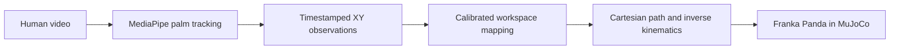
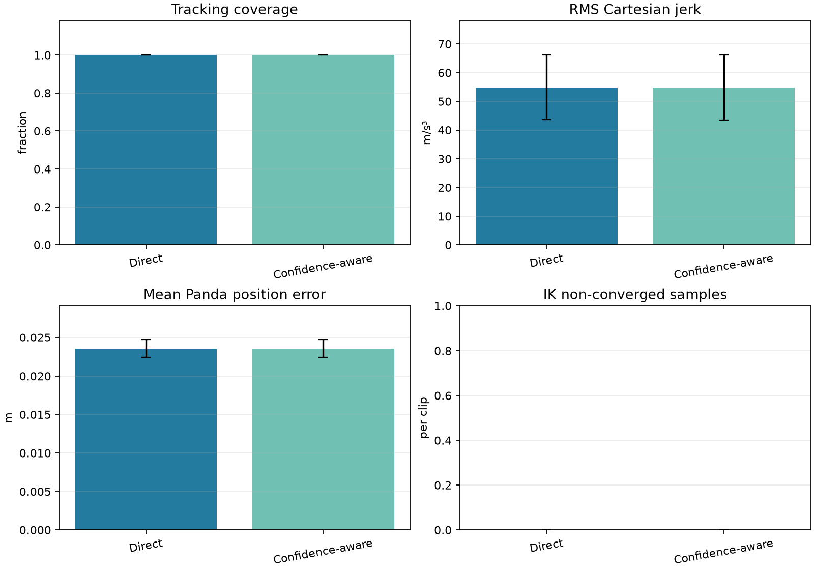

# MORPH

### Human demonstrations toward robot manipulation

MORPH is a research prototype for turning a human tabletop demonstration into a Cartesian trajectory for a simulated Franka Panda. It combines video-based hand tracking, explicit image-to-workspace mapping, inverse kinematics, and a MuJoCo manipulation baseline.

<p align="center">
  
  <br>
  <em>Measured end-effector path and tracking error from the simulated pick-and-place baseline.</em>
</p>

> **Current status:** the pipeline has been run on 16 real overhead recordings (12 labeled successful and 4 labeled failed). These labels describe the human attempts; the Panda replay is a separate kinematic simulation and does not reproduce object grasping or predict task success.

## The idea

A person performs a simple tabletop task. The system tracks the palm in the video, maps its image coordinates to a bounded Panda workspace, and replays the resulting path through inverse kinematics.



The simulation also has a separate scripted **oracle** pick-and-place sequence. It checks that the table, cube, gripper, contact physics, and target region form a solvable task. The human-video replay follows a mapped palm path; it does not infer object intent or execute a human-guided grasp policy.

## Measured simulation baseline

The oracle sequence was run in MuJoCo and checked against physical cube contact, lift, target location, and low final velocity.

| Measurement | Result |
| --- | ---: |
| Pick-and-place outcome | Success |
| Cube lifted and placed | Yes |
| Maximum cube height | 0.590 m |
| Final cube center | (0.557, −0.168, 0.425) m |
| Target center | (0.550, −0.150, 0.425) m |
| Final XY distance from target center | 0.0195 m |
| Simulation samples | 7,592 |
| Unconverged IK samples | 0 |

These are results from the scripted simulation baseline, not from a human demonstration. The source measurements are in [`results/metrics/pick_place.json`](results/metrics/pick_place.json) and [`results/metrics/pick_place.csv`](results/metrics/pick_place.csv).

## Human demonstration evaluation

Sixteen phone videos were processed locally: 12 were labeled `riusciti` (successful human attempt) and 4 `falliti` (failed human attempt). Every clip was replayed in MuJoCo with both direct and confidence-aware retargeting, for 32 completed simulations. These are mapped palm trajectories; the simulation did not attempt to grasp the item shown in the recordings.

| Mean across 16 clips | Direct | Confidence-aware |
| --- | ---: | ---: |
| Tracking coverage | 100% | 100% |
| Interpolated frames | 0 | 0 |
| Cartesian path length | 0.699 m | 0.699 m |
| RMS Cartesian jerk | 54.84 m/s³ | 54.83 m/s³ |
| Panda mean position error | 0.02354 m | 0.02354 m |
| IK non-converged samples | 0 | 0 |

<p align="center">
  
</p>

The confidence-aware method made no meaningful difference on this batch: all frames were detected and the confidence signal did not cause interpolation. Its confidence value is a hand-classification score used as a proxy, not a calibrated measure of palm localization accuracy. Position error is measured end-to-end from the Panda's reset pose; its maximum is dominated by the initial move from that pose to the first video waypoint. The XY image-to-robot mapping uses the four visible workspace markers, while robot height is fixed at 0.62 m. Treat these as a prototype evaluation, not physical camera-to-robot calibration or evidence of successful robot manipulation. Aggregate values are in [`results/metrics/human_demo_evaluation.json`](results/metrics/human_demo_evaluation.json); local per-clip data and recordings are intentionally excluded.

## What is implemented

- Panda end-effector state, damped inverse kinematics, and Cartesian path following.
- A MuJoCo table, cube, target region, and gripper with a measured oracle pick-and-place.
- Local import of original MP4, MOV, M4V, or AVI recordings with a metadata sidecar.
- MediaPipe hand tracking with decoded video timestamps, confidence scores, and an annotated video for inspection.
- Explicit image bounds, fixed robot height, missing-frame interpolation, smoothing, and a Cartesian speed cap.
- A replay command that records target-versus-actual simulation measurements as CSV, JSON, and PNG.
- Per-video workspace marker calibration, batch processing, paired local human/Panda video rendering, and aggregate method evaluation.

## Quick start

### Requirements

- macOS on Apple Silicon, Python 3.14, and the packages in [`requirements.txt`](requirements.txt).
- The Franka Panda scene from [MuJoCo Menagerie](https://github.com/google-deepmind/mujoco_menagerie). The current default path is `~/Documents/mujoco_menagerie/franka_emika_panda/scene.xml`; update `DEFAULT_MODEL_PATH` in `src/simulation/panda_env.py` if your checkout is elsewhere.
- `mjpython` for commands that open the MuJoCo viewer on macOS.

```bash
git clone https://github.com/yahiag04/MORPH.git
cd MORPH
git clone https://github.com/google-deepmind/mujoco_menagerie.git ~/Documents/mujoco_menagerie
python3 -m venv ~/Documents/.venv
source ~/Documents/.venv/bin/activate
python -m pip install -r requirements.txt
```

### Run the simulation baseline

```bash
PYTHONPATH=src mjpython scripts/run_pick_place.py
```

The script opens the viewer and saves measured outputs under `results/metrics/` and `results/figures/`.

### Process and evaluate human demonstrations

Put original clips in immediate label subfolders such as `riusciti/` and `falliti/`. The scripts write frame-level data, review videos, and calibration files to directories outside the repository. Keep your source videos private and inspect the marker review images before interpreting results.

```bash
source ~/Documents/.venv/bin/activate
PYTHONPATH=src python scripts/process_dataset.py /path/to/videos \
  --output-dir /path/to/local_morph_data
PYTHONPATH=src python scripts/calibrate_workspace.py /path/to/videos \
  --output-dir /path/to/local_morph_data/calibrations
PYTHONPATH=src python scripts/evaluate_demonstrations.py \
  --processing-manifest /path/to/local_morph_data/processing_manifest.json \
  --calibration-dir /path/to/local_morph_data/calibrations \
  --output-dir /path/to/local_morph_evaluation
```

The first processing run downloads the pinned MediaPipe hand-landmarker model to `assets/models/` and verifies its SHA-256 checksum. MediaPipe processes video frames on-device and reports API usage and performance metrics to Google. To make a paired demo for one clip after evaluation, use its annotated recording and trajectory CSV:

```bash
PYTHONPATH=src python scripts/make_paired_demo.py \
  /path/to/local_morph_data/processed/riusciti/IMG_7848_tracked.mp4 \
  /path/to/local_morph_evaluation/per_clip/riusciti/IMG_7848/direct_trajectory.csv \
  --output-dir /path/to/local_paired_demo
```

The script creates a Panda replay and a side-by-side MP4. These videos and per-clip files remain local; only aggregate metrics and a plot are checked in.

Read the full [recording, calibration, and processing protocol](docs/data_collection.md) before interpreting a replay. Marker calibration maps the recorded workspace corners to assumed robot XY bounds; it does not measure camera-to-robot geometry. Monocular video does not provide metric hand height, so the current mapping uses a fixed Z plane.

## Repository map

```text
src/
  perception/       video import, hand tracking, workspace mapping
  simulation/       Panda environment, IK, trajectory and pick-place control
  evaluation/       measured trajectory plots
scripts/            runnable import, processing, retargeting, and simulation commands
data/
  raw/              local source videos (ignored)
  processed/        local tracking output (ignored)
  trajectories/     local robot paths (ignored)
results/
  metrics/          checked-in simulation measurements
  figures/          checked-in simulation plots
tests/              unit tests and generated-video fixtures
```

## Limitations and next steps

- Demonstrations are human-labeled video; no robot grasp, object transfer, or robot task-success outcome has been evaluated.
- The current tracker follows a palm point, not the object, and does not classify task phases or grasp intent.
- Camera-to-robot bounds must be calibrated for the recording setup. The current mapping uses a fixed Z and cannot recover physical depth from a single video.
- The oracle baseline is scripted and uses a simple cube. Its success does not establish performance on human demonstrations.
- Temporal nearest-palm tracking can still confuse hands that cross or move close together.

Next, improve the confidence signal and validate physical camera-to-robot geometry before claiming that simulated replay accuracy predicts real robot behavior.

## Verification

Run the test suite from the repository root:

```bash
PYTHONPATH=src python -m unittest discover -s tests -v
```

At the current milestone, run the suite with the command above. Video unit tests use generated temporary fixtures; the 16 recordings used for the published aggregate remain local and are not included in the repository.
